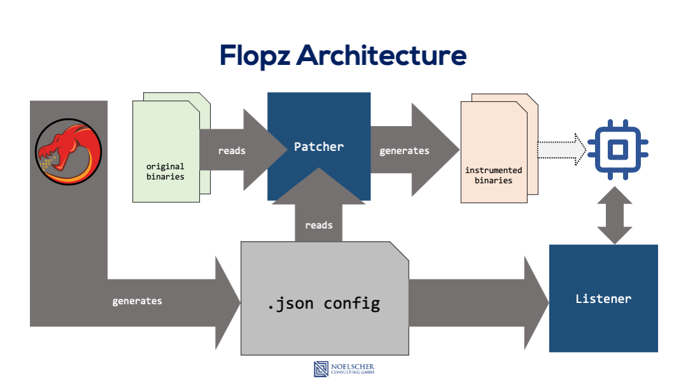

Overview
========

| This page provides an overview of the workflow when using flopz.
| Check out the :doc:`tutorial <tutorial>` section for more detailed articles on single functions.

Ghidra Plugin
_____________

| After aquiring the raw firmware you want to patch with flopz, using the Ghidra Plugin is the preferred and most convenient way to mark the locations of your gadgets.
| `Ghidra <https://ghidra-sre.org/>`_ is an open source reverse engineering tool developed by the NSA and features a plethora of tools to analyze your binary.
| The repository for our Ghidra Plugin can be found `here <https://github.com/Flopz-Project/flopz-ghidra>`_.
| After analyzing and setting up the memory mapping, the plugin makes it convenient to register free sections of flash or RAM for usage by flopz.
 It is also used to mark the instructions and functions you want to instrument. All this information can then be exported into a json configuration file that flopz will need to patch your binary.

A more detailed look at the Ghidra Plugin can be found in this :doc:`tutorial <ghidra>`.